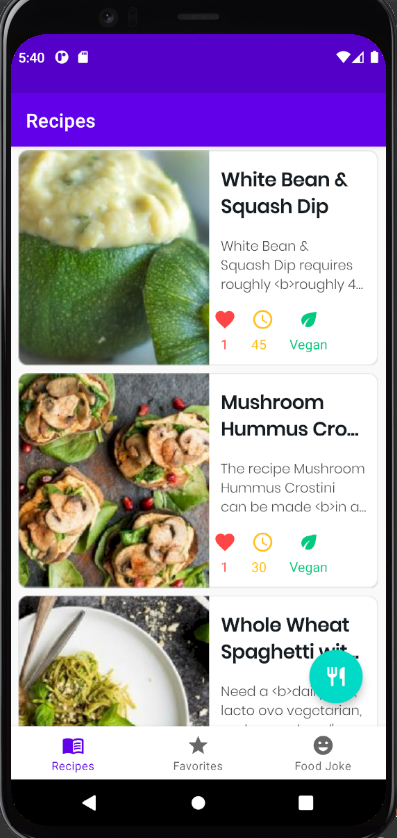

# recipes-app
Recipes app to train concepts of API consuming with Retrofit, GSON, Jsoup, Room, Databinding, Coil, Coroutines and Dagger-Hilt for di. 
#### this is a 'forfun' project that im doing based in a course.

### In progress...

### Current situation (19/12/2021)
+   Fetched data from Spooncular API
 
    

#### main architecture
+ mvvm, with remote datasource to fetch data and local to store specific data

### offline cache
we only do api requests to the remote datasource when:
+ we firstly install the app
+ we explicitly do a specific data request from the API.
otherwise, all the primarily fetched data is stored in a local datasource (room).
