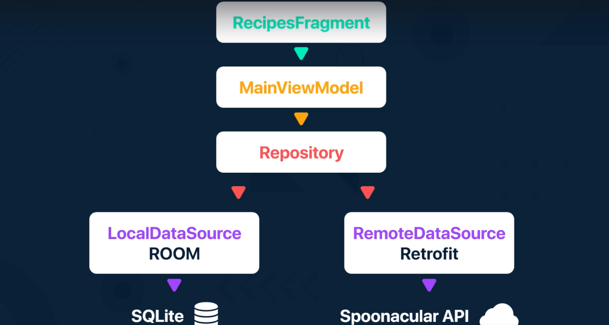

# recipes-app
Recipes app to train concepts of API consuming with Retrofit, GSON, Jsoup, Room, Databinding, Coil, Coroutines and Dagger-Hilt for di. 
#### this is a 'forfun' project that im doing based in a course.

### In progress..

### offline cache
we only do api requests to a remote datasource when:
+ we firstly install the app
+ we explicitly mas a specific data request from api
otherwise, all the primarily fetched data is stored in a local datasource (room).

#### main architecture
